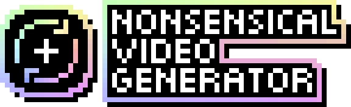

# Home
Welcome to my website! I'm KiwifruitDev, a software developer based in Las Vegas, Nevada. I'm a silly programming wizard!

My programming journey started in 2013 when I was 9 years old. I learned Roblox Lua, which led me to learn Garry's Mod Lua and eventually game server hosting in 2014. Later in 2015, I learned how to use the Source Engine asset pipeline (materials, maps) for my own Team Fortress 2 servers and other Source games.

Nowadays, I work with .NET alongside the Source Engine and other miscellaneous tools. I'm obsessed with [Source Filmmaker](https://store.steampowered.com/app/1840/Source_Filmmaker/) development in particular. Usually I work on niche projects from being involved in niche communities.

## Notable Projects

### 

**Nonsensical Video Generator** (NVG) is an automated video production tool which uses imported media to randomly remix videos. This project was derived from an earlier project that I released in November 2019 called YTP++.

NVG started development in March 2023, and was released on Steam in July 2023.

**Links**
- [Steam store page](https://store.steampowered.com/app/2516360/Nonsensical_Video_Generator/)
- [Discord server](https://discord.com/invite/8ppmspR6Wh)
- [GitHub issues & wiki](https://github.com/KiwifruitDev/NonsensicalVideoGenerator)

### 

**Director's Cut** is a community-driven filmmaking tool for the Source Engine. Based on the recently-released Team Fortress 2 SDK (Source SDK 2013), this project aims to become an actively-maintained alternative to Source Filmmaker.

I'm the project lead for Director's Cut, which started development in May 2022. There are 4 other contributors, and we are currently in pre-alpha.

**Links**
- [GitHub repository](https://github.com/DirectorsCutMod/DirectorsCut)
- [Bluesky profile](https://bsky.app/profile/directorscut.bsky.social)
- [Discord server](https://discord.com/invite/zrjApe5gkk)
- [Valve Developer Wiki page](https://developer.valvesoftware.com/wiki/Director's_Cut)
- [YouTube channel](https://youtube.com/@DirectorsCutMod)
- [Reddit community](https://www.reddit.com/r/DirectorsCut)

### 
**Kiwi's Co-Op Mod for Half-Life: Alyx** (KCOM) added a co-op mode for [Half-Life: Alyx](https://store.steampowered.com/app/546560/HalfLife_Alyx/). It worked by reverse-engineering the VConsole2 protocol, which is used for the game's console commands. By using VScript code to print out messages to the console, a .NET application can read these messages and send commands to the game. This led to the ability to network player positions and other game data.

This project was released in 2022, and I no longer maintain it.

## Minor Projects

### [Source Filmmaker Scripts](https://steamcommunity.com/sharedfiles/filedetails/?id=3232212213)
From 2023 onwards, I released several Python scripts to the SFM Workshop that enhance the user experience of Source Filmmaker. Examples include a light limit patch, viewport resolution patch, and other tools like an autoinit manager.

### [Arkham Revived (Self-Hosted)](https://github.com/KiwifruitDev/ArkhamRevivedSelfHosted)
A self-hosted authentication server for the online multiplayer mode of [Batman: Arkham Origins](https://store.steampowered.com/app/209000/Batman_Arkham_Origins/). This was the result of reverse-engineering the original server when it was still online. Game networking is P2P, meaning that once the auth server is bypassed, you can still play online.

I [originally](https://github.com/KiwifruitDev/arkham-revived) released this project in 2023, however I no longer maintain either version.

### [Gameboy Printer Emulator Server](https://github.com/KiwifruitDev/gameboy-printer-emulator-server)
A node.js command line interface designed to be used with the [Arduino Gameboy Printer Emulator](https://github.com/mofosyne/arduino-gameboy-printer-emulator) project. It was designed to run on a Raspberry Pi. I made this to allow me to print out photos from my Gameboy Camera to a Bluetooth thermal printer from my phone.

This project was released in 2023, and I no longer maintain it.

## Attributions

The KiwifruitDev and Director's Cut logos were created by [FLARE145](https://flare145.com).

Art of Kiwano Maxwell was drawn by [MoonMoon1124](https://bsky.app/profile/moonmoon1124.bsky.social).
