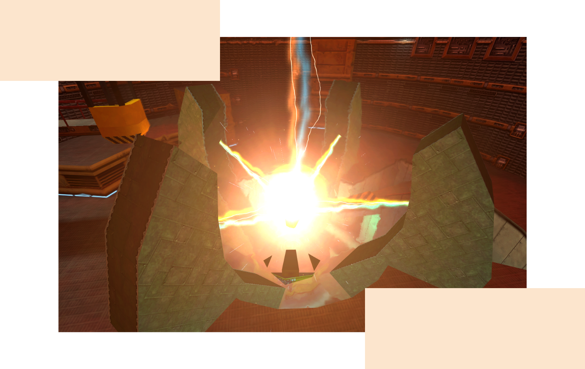

# Server Rules
<!---

-->

These rules apply to *Wildfire Black Mesa RP*.

?> Rules written by Mel/Anderson, Treycen, and Kiwifruit. Formatted for Docsify by Kiwifruit. Last edited by Kiwifruit on 11/29/2021.

#### *Staff Roster*

- Server Management
    - Kiwifruit (Owner)
    - Flynn (Developer)
- Black Mesa RP Staff
    - Mel/Anderson (Head of Staff)
    - Florida Man (Admin)
    - Randy (Admin)
    - Ethan Vondwarf (Moderator)
    - Murph (Moderator)
    - George Limeston (Moderator)
    - Tom (Trial-Moderator)

!> Warned? Banned? Feel free to create an appeal on the [Wildfire Servers Discord](https://discord.gg/5gX3rdymxx).

## **First off!**
Absolutely no transphobic, homophobic, enby-denying, neurodivergent judgement thrown in this server. If you fall into any of these groups, It doesn’t mean you can throw them around as well. We all need full respect for each other and ourselves, even if you don’t agree with some ideas or statements. If you cannot respect someone’s identity or orientation and you have an issue with it and you will cause problems, please leave the server. If you are actively targeting somebody on the server because of this, then we will have to administer punishment accordingly.

## **Second off!**
Roleplay. Despite this server being semi-serious, we are a little more lenient to the happiness and requests of a majority of players and between us as staff as well. With that, keeping consistent BMRP and character themes straight on is what we’re looking for. Roleplay is something that will be public, and can even happen between admins with an average player. Please, during roleplay, whenever an admin is involved, do not treat them as kings and or queens of the world. Be fair to players when they are to roleplay as well, and always have permission by either a staff, or that player themselves to do something. For example,. let’s say a player is being hunted down. If that player gives the hunter permission to kill, then they are allowed to kill that player as long as there is enough comfort by permission from the player. RDM is not something that is tolerated here, and If you rapidly continue, you will be banned. No questions asked. 

## **Third!**
As stated in the first rule, this goes along with it. Slurs. If you are caught with evidence using a slur of any culture to try and cause issues, be funny, the usual, this is an immediate ban. There are no ban appeals for something that has been created in the use of harm to specific races and people. We do NOT tolerate it. 

## **Fourth!**
Sensory overloads. Sensory overload is when a person’s hearing, touch, or even taste is more sensitive than somebody's common ability. This means that mic spamming is extremely harmful to folks that have these issues, and you will be punished without warning if caught mic spamming enough, due to the harm it genuinely causes. We must protect our players.

## **Fifth!**
Annnnnd a very, very common rule but absolutely no politics. Political chats can cause a massive controversy to something of heat that can be quite hard to calm down with large influential groups of folks. Your opinion and belief is something that you can express and cherish outside of a roleplay server, but we just can't have that going around since it can also invite the worst of folks into the worst of behaviour and mannerisms. We as staff respect you! Just, not something that needs to be considered in Black Mesa.

## **Sixth!**
This BMRP server is very diverse within its community and we allow all forms of culture to be invited here. But cultures that may have harmful views on another must be kept outside of BMRP.  Some of us as staff cannot relate to these issues or understand even the smaller things that may make a culture that culture. But, if something is actively being brought down due to belief, that is again, something that must not be shared or even indicated on the server. We will discipline.

## **And seventh!**
We as admins will always be able to help and respond to any situation even if it's minor at times. But please do not look at us as if we are robots, abusing the staff request in-game and via discord to something so minimal does not lower us as people if we refuse to deal with something that is not at all a problem. We are not lowered as people, if you complain about a player who is just following the rules. We do not become minimal to a group of folks, over something so enticed. If you have any staff complaints, please do report them to Bobby or the admin that currently may supervise another temporarily. If you are to complain about staff, please be respectful and front forward so we can attend to your issue on how we can fix it. Disrespecting staff while at the same time making a complaint with no details does not at all help you or our staff team. 

# **Community-wide in-game rules & information:**
1. Do not attempt to RDM. *(RDM aka Random Deathmatch is killing another player without any plausible RP reason)*
2. Do not perform any ERP on this server, ever. *(ERP is performing sexual or erotic acts with another player. Doing this will get you permanently banned with no exceptions.)*
3. Do not break NLR. *(NLR aka New Life Rule is basically "forgetting" your past after you die. This rule basically prevents you from being killed, coming back and shooting the person that killed you. it also prevents character grudges, etc.)*
4. Do not use any props in any form of abusive manner. *(This basically means, don't fly around on props, don't spam props into walls, don't slam props into the floor, don't attempt to kill other players with props, etc.)*
5. LTAP & CNTAP. *(This is also known as Leaving To Avoid Punishment and Changing Name To Avoid Punishment. Both of these offenses will result in the same exact result... a ban. Attempting to avoid your ban usually means you've done something wrong. Do this, and you're out for 2 days.)*
6. Cheating, scripting, and hacking. *(You'll be immediately permanently banned, don't try it.)*
7. Every rule above and every Discord rule applies here. *(Just in-case something isn't stated here, just so you know everything applies.)*
8. This shouldn't even need to be a rule, but don't attempt to "loophole" the rules to get yourself out of something.
9. Staff hold their own discretion for the results of staff sits. You agree to this when you play the server.
10. Do not break FailRP. *(An example of breaking FailRP would be... an R&D Scientist shooting a Spas-12. Just doesn't make sense.)*
11. Do not metagame. *(An example of metagaming is receiving information from an OOC (out-of-character) chat. Another example is getting a players location from the tab menu and using it somehow in an RP scenario. "Security! He's in --!")*
12. FearRP is not active in this server.
13. Do not purchase a lab unless your job description says otherwise. *(In your job description it will tell you If you are allowed to purchase a lab.)*
14. Do not enter a clearance area higher than your clearance unless you have an escort. *(For example, a Janitor Level 02 enters a Level 04 area. You are not allowed in there unless you are with someone with 04 clearance or higher.)*
15. If you are not signed-in, you are automatically recognized as the lowest rank in your hierarchy. *(For example, If you are playing Security and you choose not to sign-in, you are automatically recognized as a "Cadet.")*
16. Canonical names from Black Mesa/Half-Life series are not allowed. *(For example, a name such as Gordon Freeman)*
17. Our final and **GOLDEN RULE**... Use common sense, really. it's not hard to understand when to interject into an RP scenario or to kill somebody. Even If you don't read the rules page but just use common sense on the server, I'm sure you'd be fine.

**Below are our category/job specific rules, be sure to read up on those as well.**

# **BMRP Category/Job specific rules:**
**Surface Jobs:**
1. You may build on the surface as any form of surface job as long as it's not disrupting roleplay.
2. Entering the facility as a surface job is not against the rules. You as a Visitor are allowed in the entrance zone/area. If you are killed or arrested in this area, please call a staff member and let them know. You are NOT however allowed past the entrance zone. *(This means the lab hallways, security sectors, etc.)*

**Facility Staff:**
1. The only Facility Staff that are permitted to carry small firearms are as follows: R&D Scientist, Hazardous Environment Researcher, and Surveyor. The only firearms that these bunch are allowed to carry are: Tau Cannon, Gluon Gun, and pistols/small firearms.
2. If you need to take a blood sample from either a fellow player, do not spam it. *(The syringe does 1 damage for RP sake, I won't hesitate to remove it if needed.)*
3. Hazardous Environment Researchers have special permission to retrieve test subjects. This also means that they can test on them in whatever ways they want to. If you agree to be a test subject, they own you.
4. Surveyors are NOT allowed to enter Xen without the presence of at least 1 R&D Scientist. To even start the Lambda core, an R&D Scientist needs to do it. It makes no sense for a Surveyor to start the machine and enter completely alone without anyone knowing.

**Facility Administration:**
1. As the Facility Administrator you have the power to initiate a lockdown at anytime. Because this is Black Mesa, this also sounds the alarms to the entire facility. If you abuse the lockdown system, you will be warned.
2. During the events of a resonance cascade, while it is not required, the Facility Administrator may initiate a command known as "/hecu". This command will "call-in" the HECU to the facility allowing them to interact with scanners and other tools.
3. As a member of the Security team, it's important to understand and realize when you should attempt to kill, arrest, etc. it is also important to understand which weapons are required for the situation at hand. *(For example, If someone isn't showing any threat but isn't where they are supposed to be, you'd attempt to arrest. Is there a random headcrab in the facility? A pistol would be useful for extermination. You should never randomly discharge your weapon at any time. Security Heavy Weapons have access to smoke grenades, and with this comes great responsibility. Using common sense and understanding when to use these tools are important. it's important to understand and ask questions because you CAN be blacklisted from Security.)*
4. As a member of the Security team it's important to understand your role in the hierarchy. While it is not required to sign-in, it adds a lot of roleplay value to Security. *(Located at the Sign-in terminal, you'll find a bunch of different ranks and divisons based on the XP requirement. The ranks are in order, along with divisons. If you are a Cadet, and you are ordered by someone higher than you, you must respond to them. This applies to every other rank as well.)*
5. Being apart of the Security force also means you have a special role. *(This means, If you are roleplaying as Heavy Weapons or a Medic, you have different jobs from being a normal Security Officer. In a gun fight, the medics are required to stay back and support the team with cover fire and healing at any time. If you are apart of the Heavy Weapons you must stay forward, supporting your officers with bigger guns.)*
6. As any form of Security Officer you may build checkpoints anywhere and everywhere in the facility. You may make players show their ID to enter/exit. If no H.E.C.U are online, Security have full jurisdiction of topside. If H.E.C.U are on, you do not have jurisdiction.
7. No matter the rank of the Security Officer(s), you must always follow the orders of the Facility Administrator.
8. The Commander of the Security should be recognized as the top rank possible. It is normally unattainable without being added to a special SteamIDs list. Your Commanders can set your XP values, blacklist you from Security, etc. Following orders of the Commander is crucial unless you'd rather be demoted...
9. As a member of the Security Team It's important to understand when to arrest visitors that enter the facility. A visitor is allowed to enter the entrance zone of the facility and will not require a KOS/AOS. You may however attempt to arrest/kill If they proceed deeper into the facility.

**H.E.C.U:**
1. First things first, H.E.C.U are not allowed to enter the facility at any time unless called in by the Facility Administrator. *(You shouldn't have access to any of the scanners unless you are called in.)*
2. H.E.C.U are allowed to build checkpoints on the surface pretty much everywhere.
3. H.E.C.U are only permitted to kill Xenians, NOT scientists or any other form of Facility Staff. *(This may be changed during an event.)*
4. The near-same rules of security apply to H.E.C.U, just because you are apart of the containment unit doesn't mean you can't be blacklisted from It.

**Xenian Lifeforms:**
1. Xenians are allowed to enter the earth at any time under any circumstance. HOWEVER, planned attacks on the overworld are not permitted. *(By this I mean, It's okay for one or two headcrabs to come through every now and then. It's NOT okay for 4-5 Vortigaunts to come flying into the facility at a random time.)*
2. During the events of a resonance cascade, anything and everything is permitted to come through from Xen. If you want 8 Vortigaunts to rush the overworld at the same time, go for it.
3. Xenians and human lifeforms are not friends nor are they enemies. It's completely up to the user If they want to kill the Xenian vice versa.
4. Vortigaunts and other Xenian creatures may be captured and placed in a lab/containment unit to be experimented on at anytime. *(A Xenian can fight back or roleplay with it.)*
5. Any abuse of your pill will result in a warn and then an immediate job ban. *(This means using "v" to reset your HP when in your pill.)*

**THESE RULES ARE SUBJECTED TO CHANGE AT ANYTIME. THANKS FOR PLAYING WILDFIRE BLACK MESA ROLEPLAY.**

?> Copyright (C) 2021 Wildfire Servers All rights reserved.
